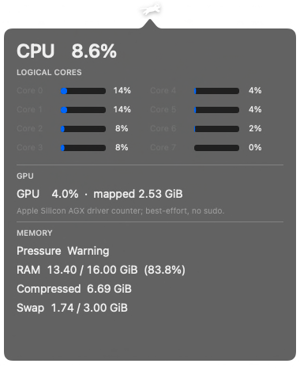
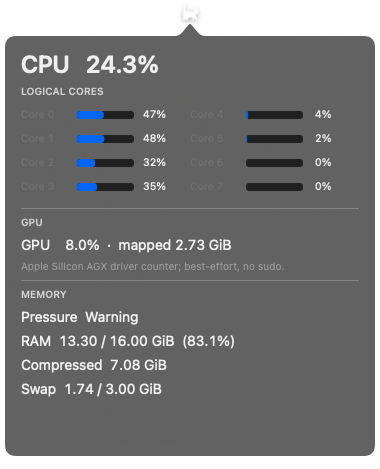

# Cat Menu Bar

A small native macOS menu-bar monitor whose running-cat speed follows total CPU load.

Cat Menu Bar targets macOS 11 Big Sur and later. It is written in Swift with
AppKit, QuartzCore, Mach, and IOKit, with no third-party runtime dependencies.

<p>


</p>

## Features

- Running cat in the menu bar; animation speed tracks total CPU load.
- Compact scrolling CPU/GPU history graph with a bounded 60-second window.
- Two animation styles:
  - **Classic [RunCat](https://github.com/Kyome22/menubar_runcat)**, the original five-frame art by Takuto Nakamura (Kyome22).
  - **Ruslan outline**, from [RuslanDemyanov/RunningCat](https://github.com/RuslanDemyanov/RunningCat)'s `cat walking.json`, rendered by a small built-in subset renderer instead of shipping Lottie.
- Left-click: live panel with total CPU, every logical core, memory pressure, RAM/compression/swap, and best-effort Apple Silicon GPU usage.
- Right-click: choose cat style, About, or Quit.
- Stops sampling/animation across system sleep and resumes on wake.

## Download and run

Download the macOS archive from the project's GitHub Releases page, unzip it,
and open `Cat Menu Bar.app`. Release builds are ad-hoc signed rather than
Apple-notarized, so macOS may ask you to confirm the first launch with
Control-click > Open.

Release archives are architecture-specific: an `arm64` build is for Apple
Silicon, while an `x86_64` build is for Intel Macs.

## Build from source

The normal build uses `swiftc` directly:

```bash
./build-app.sh
open "build/Cat Menu Bar.app"
```

You need a macOS Swift compiler and a macOS SDK supported by that compiler.
The script uses `xcrun --sdk macosx --show-sdk-path` when available and falls
back to the compiler's configured SDK. It builds for the current Mac
architecture. `codesign` is optional and is used only for an ad-hoc local
signature.

On the first build, `vendor-assets.sh` downloads the pinned upstream Apache-2.0
animation assets if either asset is absent. Later builds reuse the checked-in
assets. `Package.swift` is retained as an optional Swift Package Manager
project description, but `build-app.sh` does not depend on `swift build`.

## Source structure

- `main.swift` — creates `NSApplication` and enters the AppKit event loop.
- `AppDelegate.swift` — accessory/menu-bar app startup and main app menu.
- `AppConfig.swift` — central tuning values for sampling, smoothing, animation speed, and UI layout.
- `ExponentialSmoother.swift` — time-aware exponential smoothing for displayed CPU and cat speed.
- `StatusController.swift` — owns the status item, popover, context menu, sleep/wake behavior, selected cat style, and CPU-to-speed mapping.
- `HistoryGraphView.swift` — draws the bounded CPU/GPU history graph with adaptive colors and reference guides.
- `CatLayerView.swift` — menu-bar renderer; animates cached `CGImage` frames with Core Animation.
- `CatFrameLoader.swift` — loads/rasterizes both cat animation families.
- `MiniLottieRenderer.swift` — intentionally tiny renderer for only the vector/keyframe features used by Ruslan's bundled Lottie JSON.
- `SystemSampler.swift` — background sampling scheduler: 1 Hz normally, 2 Hz while the popover is open.
- `CPUSampler.swift` — total and per-logical-core usage from Mach `host_processor_info()` tick deltas.
- `MemorySampler.swift` — RAM/compression/swap from Mach VM statistics and `sysctl`.
- `GPUReader.swift` — best-effort Apple Silicon GPU utilization/mapped memory from the AGX IOKit registry.
- `StatsViewController.swift`, `CoreBarsView.swift` — lightweight AppKit statistics UI.
- `Models.swift` — metric snapshot/value types and cat-style enum.
- `ResourceLocator.swift` — finds animation assets in the app bundle, source tree, or `CAT_MENUBAR_RESOURCE_DIR`.
- `build-app.sh` — direct `swiftc` compile + `.app` assembly + optional ad-hoc signing.
- `vendor-assets.sh` — fetches pinned third-party assets and verifies Git blob IDs when `git` is available.

## Design choices

**Low resident overhead.** The cat is animated by `CAKeyframeAnimation`; Swift does not wake for every frame. Every source frame gets an equal interval, while the animation playback speed is retimed when a new smoothed CPU sample arrives. Expensive-ish RAM/GPU sampling is disabled while the panel is closed.

**Native APIs, no helper processes.** CPU/RAM use Mach APIs. GPU uses IOKit directly rather than periodically spawning `ioreg` or `powermetrics`. The app has no Electron/WebView, Python process, Lottie framework, or other runtime dependency.

**Logical-core truth over guessed topology.** Per-core bars report what Mach exposes. The app does not guess M1 P-core/E-core identity from ordering unless a reliable API is added later.

**Small special-purpose Lottie implementation.** Ruslan's animation is pre-rendered into cached frames at startup. Supporting only that asset keeps code/RAM/CPU smaller than embedding a general animation engine.

## Known weaknesses

- **GPU telemetry is unofficial.** `AGXAccelerator/PerformanceStatistics` is an undocumented driver interface and can be missing or renamed; the UI then shows `N/A`.
- **RAM “used” is an approximation.** macOS memory accounting has several reasonable definitions. This uses occupied VM pages minus cheaply reclaimable purgeable/external cache, similar to established system monitors, but it will not exactly equal every Activity Monitor number.
- **Memory pressure is event-driven.** The Normal/Warning/Critical label comes from the system Dispatch memory-pressure signal and starts at Normal until macOS reports a pressure transition.
- **Ruslan renderer is deliberately incomplete.** It handles this animation, not arbitrary Lottie files; easing is simplified and decorative speed-line layers are omitted.
- **No historical graphs yet.** Metrics are current snapshots only.
- **No P/E-core labels yet.** Bars are logical CPUs in Mach's order.

## Plausible future features

- User-adjustable sample interval and CPU-to-cat-speed curve.
- Optional CPU percentage text beside the cat.
- Short rolling graphs for CPU/GPU/RAM in the popover.
- P-core/E-core grouping on Apple Silicon when topology can be identified robustly.
- Thermal pressure, load average, battery/power, network, disk I/O, and top-process views, all opt-in so idle overhead stays low.
- Launch-at-login support.
- Custom runner/frame-set import.
- Better Ruslan animation fidelity, or offline pre-rasterization to remove the subset renderer from the runtime entirely.
- Self-monitoring/debug panel showing Cat Menu Bar's own CPU, wakeups, and resident memory.

## Privacy

At runtime the app reads local system counters through Mach and IOKit. It does
not collect analytics, contact a service, or send system metrics over the
network. The build helper may download the pinned animation assets from
GitHub when they are not already present.

## Licenses / attribution

See `THIRD_PARTY_NOTICES.md` and `LICENSE`. The borrowed [RunCat](https://github.com/Kyome22/menubar_runcat) and [RunningCat](https://github.com/RuslanDemyanov/RunningCat) material is Apache-2.0 and pinned to specific upstream revisions.
